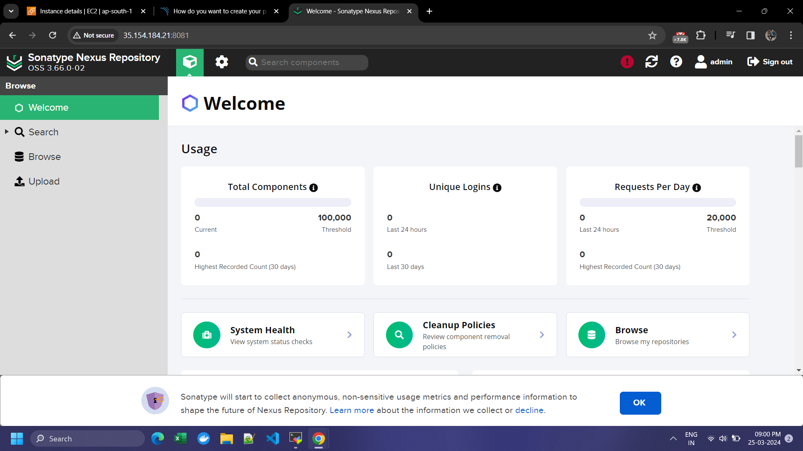
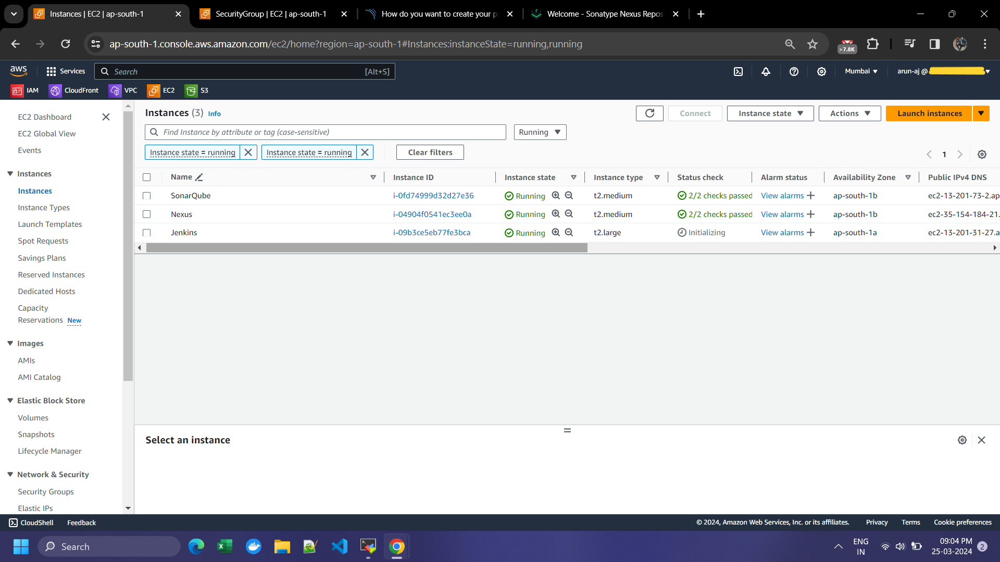

---

# BoardGame End to End CI/CD setup and Deployed with Kubernetes  
# Phase 1 - Infrastructure Setup

This README provides detailed instructions for setting up infrastructure for Jenkins, SonarQube, Nexus, and Kubernetes. Each step is accompanied by commands and screenshots to ensure smooth setup.

## Step 1: Setting up Infrastructure

### 1.1 Created Instances for Jenkins, SonarQube, and Nexus

1. **Jenkins Instance**:
   - Launched a t2.large EC2 instance with Ubuntu OS.
   - Allocated 30 GiB of EBS volume.
   - Used a security group allowing ports: 22, 25, 80, 443, 6443, 465, 3000-10000, 30000-32767.
   

   

2. **SonarQube Instance**:
   - Launched a t2.medium EC2 instance with Ubuntu OS.
   - Allocated 20 GiB of EBS volume.
   - Used the same security group as Jenkins.

   


3. **Nexus Instance**:
   - Launched a t2.medium EC2 instance with Ubuntu OS.
   - Allocated 20 GiB of EBS volume.
   - Used the same security group as Jenkins.

   

   

#### SSH into Instances and Configure

**Jenkins Instance:**
```bash
ssh -i <keypair.pem> ubuntu@<jenkins-instance-public-ip>
```
```bash
# Install Java and Jenkins
sudo apt update -y
sudo apt install openjdk-17-jre-headless -y
sudo wget -O /usr/share/keyrings/jenkins-keyring.asc \
https://pkg.jenkins.io/debian-stable/jenkins.io-2023.key
echo deb [signed-by=/usr/share/keyrings/jenkins-keyring.asc] \
https://pkg.jenkins.io/debian-stable binary/ | sudo tee \
/etc/apt/sources.list.d/jenkins.list > /dev/null
sudo apt-get update -y
sudo apt-get install jenkins -y
sudo systemctl enable jenkins
sudo systemctl start jenkins
sudo systemctl status jenkins
```
```bash
# Install Docker
sudo apt-get update
sudo apt-get install ca-certificates curl
sudo install -m 0755 -d /etc/apt/keyrings
sudo curl -fsSL https://download.docker.com/linux/ubuntu/gpg -o /etc/apt/keyrings/docker.asc
sudo chmod a+r /etc/apt/keyrings/docker.asc

# Add the repository to Apt sources:
echo \
"deb [arch=$(dpkg --print-architecture) signed-by=/etc/apt/keyrings/docker.asc] https://download.docker.comlinuxubuntu \
$(. /etc/os-release && echo "$VERSION_CODENAME") stable" | \
sudo tee /etc/apt/sources.list.d/docker.list > /dev/null
sudo apt-get update

sudo apt-get install docker-ce docker-ce-cli containerd.io docker-buildx-plugin docker-compose-plugin

chmod 666 /var/run/docker.sock
```

```bash
# Install Trivy
sudo apt-get install wget apt-transport-https gnupg lsb-release

wget -qO - https://aquasecurity.github.io/trivy-repo/deb/public.key | gpg --dearmor | sudo tee /usr/share/keyrings/trivy.gpg > /dev/null

echo "deb [signed-by=/usr/share/keyrings/trivy.gpg] https://aquasecurity.github.io/trivy-repo/deb $(lsb_release -sc) main" | sudo tee -a /etc/apt/sources.list.d/trivy.list

sudo apt-get update

sudo apt-get install trivy
```


**SonarQube Instance:**
```bash
ssh -i <keypair.pem> ubuntu@<sonarqube-instance-public-ip>
```
```bash
# Install Docker
# Commands same as in Jenkins setup

# Run SonarQube Container
docker run -d --name sonar -p 9000:9000 sonarqube:lts-community
```


**Nexus Instance:**
```bash
ssh -i <keypair.pem> ubuntu@<nexus-instance-public-ip>
```
```bash
# Install Docker
# Commands same as in Jenkins setup

# Run Nexus Container
docker run -d --name nexus -p 8081:8081 sonatype/nexus3
```


### 1.2 Access Instances in Web Browser

- Obtained public IP addresses of each instance and access:
  - Jenkins: `http://<jenkins-instance-public-ip>:8080`
  - SonarQube: `http://<sonarqube-instance-public-ip>:9000`
  - Nexus: `http://<nexus-instance-public-ip>:8081`
  
  
  

## Step 2: Kubernetes Setup

### 2.1 Create VMs for Kubernetes Cluster

- Launched VMs with the following specifications:
  - Instance Type: t2.medium
  - Operating System: Ubuntu
  - EBS Volume: 25 GiB
  - Security Group: Same security group as previous instances

#### Screenshots:
- 

### 2.2 Configure Kubernetes Nodes

1. **Update System Packages[On Master node And Worker Node ]**:
   ```bash
   sudo apt-get update
   ```

2. **Install Docker[On Master node And Worker Node ]**:
   ```bash
   sudo apt install docker.io -y
   sudo chmod 666 /var/run/docker.sock
   ```

3. **Install Required Dependencies for Kubernetes[On Master node And Worker Node ]**:
   ```bash
   sudo apt-get install -y apt-transport-https ca-certificates curl gnupg
   sudo mkdir -p -m 755 /etc/apt/keyrings
   ```

4. **Add Kubernetes Repository and GPG Key[On Master node And Worker Node ]**:
   ```bash
   curl -fsSL https://pkgs.k8s.io/core:/stable:/v1.28/deb/Release.key | sudo gpg -dearmor -o /etc/apt/keyrings/kubernetes-apt-keyring.gpg
   echo 'deb [signed-by=/etc/apt/keyrings/kubernetes-apt-keyring.gpg] https://pkgs.k8s.io/core:/stable:/v1.28/deb/ /' | sudo tee /etc/apt/sources.list.d/kubernetes.list
   ```

5. **Install Kubernetes Components[On Master Node ]**:

**Note:i have used a version below 1.28 a there were some issues in 1.29** 
   ```bash
   sudo apt install -y kubeadm=1.28.1-1.1 kubelet=1.28.1-1.1 kubectl=1.28.1-1.1
   ```


### 2.3 Initialize Kubernetes Master Node[On Master Node ]

```bash
sudo kubeadm init --pod-network-cidr=10.244.0.0/16
```

**Note:inorder to create the the Kuberenetes cluster ,after installing kubernetes in master it gives output called Kube adm join which helps join 2 slave node to the master node[On slave Nodes ]**
   ```bash
   kubeadm join 172.31.10.157:6443 --token hnwxyl.jt67hhkxo4o92mat \
        --discovery-token-ca-cert-hash sha256:44c67e72067b41f963ddf08dd0a99192644f5c96d7916443a4fb903759d53796
   ``` 


### 2.4 Configure Kubernetes Cluster[On Master Node ]

```bash
mkdir -p $HOME/.kube
sudo cp -i /etc/kubernetes/admin.conf $HOME/.kube/config
sudo chown $(id -u):$(id -g) $HOME/.kube/config
```

### 2.5 Deploy Networking Solution (Calico)[On Master Node ]

```bash
kubectl apply -f https://docs.projectcalico.org/v3.20/manifests/calico.yaml
```

### 2.6 Deploy Ingress Controller (NGINX)[On Master Node ]

```bash
kubectl apply -f https://raw.githubusercontent.com/kubernetes/ingress-nginx/controller-v0.49.0/deploy/static/provider/baremetal/deploy.yaml
```

---


---

# Project README: Phase 2 - Private Git Setup


## Step 1: Create a Private Git Repository

1. **Go to your Preferred Git Hosting Platform**:
   - Visit your preferred Git hosting platform (e.g., GitHub, GitLab, Bitbucket).
   - Log in to your account or sign up if you don't have one.

2. **Create a New Repository**:
   - Create a new repository and set its visibility to private.

## Step 2: Generate a Personal Access Token

1. **Navigate to Account Settings**:
   - Go to your account settings or profile settings on the Git hosting platform.

2. **Generate a New Token**:
   - Look for the "Developer settings" or "Personal access tokens" section.
   - Generate a new token, providing it with the necessary permissions (e.g., repo access).

## Step 3: Clone the Repository Locally

1. **Open Git Bash or Terminal**:
   - Open Git Bash or your terminal application on your local machine.

2. **Navigate to Desired Directory**:
   - Navigate to the directory where you want to clone the repository.

3. **Clone the Repository**:
   - Use the `git clone` command followed by the repository's URL.
     ```bash
     git clone <repository_URL>
     ```

## Step 4: Add Your Source Code Files

1. **Navigate into Cloned Repository Directory**:
   - Navigate into the cloned repository directory.

2. **Add Source Code Files**:
   - Paste your source code files or create new ones inside this directory.

## Step 5: Stage and Commit Changes

1. **Stage Changes**:
   - Use the `git add` command to stage the changes.
     ```bash
     git add .
     ```

2. **Commit Changes**:
   - Use the `git commit` command to commit the staged changes along with a meaningful message.
     ```bash
     git commit -m "Your commit message here"
     ```

## Step 6: Push Changes to the Repository

1. **Push Changes**:
   - Use the `git push` command to push your committed changes to the remote repository.
     ```bash
     git push
     ```

2. **Enter Personal Access Token as Authentication**:
   - When prompted for credentials during the push, enter your username (usually your email) and use your personal access token as the password.

By following these steps, you'll be able to create a private Git repository, connect to it using Git Bash, and push your code changes securely using a personal access token for authentication.

---


---

#  Phase 3 - CI/CD Setup


## Step 1: Install Required Plugins in Jenkins

1. **Eclipse Temurin Installer**:
   - Install this plugin to enable Jenkins to automatically install and configure the Eclipse Temurin JDK.
   
2. **Pipeline Maven Integration**:
   - Install this plugin to provide Maven support for Jenkins Pipeline.

3. **Config File Provider**:
   - Install this plugin to define configuration files centrally in Jenkins.

4. **SonarQube Scanner**:
   - Install this plugin to integrate Jenkins with SonarQube for code quality and security analysis.

5. **Kubernetes CLI**:
   - Install this plugin to allow Jenkins to interact with Kubernetes clusters using `kubectl`.

6. **Kubernetes**:
   - Install this plugin to integrate Jenkins with Kubernetes by allowing Jenkins agents to run as pods within a Kubernetes cluster.

7. **Docker**:
   - Install this plugin to enable Jenkins to interact with Docker, allowing Docker builds and integration with Docker registries.

8. **Docker Pipeline Step**:
   - Install this plugin to extend Jenkins Pipeline with steps to build, publish, and run Docker containers.

## Step 2: Configure Plugins in Jenkins

- Configure each plugin according to your specific environment and requirements. This typically involves setting up credentials, configuring paths, and specifying options in Jenkins global configuration or individual job configurations. Refer to the documentation provided with each plugin for detailed instructions.

## Step 3: Define Jenkins Pipeline Script

```groovy
pipeline {
    agent any

    tools {
        jdk 'jdk17'
        maven 'maven3'
    }

    environment {
        SCANNER_HOME = tool 'sonar-scanner'
    }

    stages {
        stage('Git Checkout') {
            steps {
                git branch: 'main', credentialsId: 'git-cred', url: 'https://github.com/arun-prasad-j27/Boardgame.git'
            }
        }

        // Rest of pipeline is in Jenkinsfile ,make sure to take that as a reference 
    }

    
}
```

## Step 4: Customize Jenkins Pipeline Script

- Customize the Jenkins pipeline script to fit your project's specific requirements. You can add more stages for build, test, code analysis, deployment, etc., based on your project's workflow.

## Step 5: Execute CI/CD Pipeline

- Trigger the Jenkins pipeline to execute the CI/CD process automatically whenever changes are pushed to the repository or manually as needed.


## Step 6: Set up Monitoring with Grafana and Prometheus

1. **Installed and Configure Prometheus**:
   - Install Prometheus on a server accessible Monitoring instance.
   - Configure Prometheus to scrape metrics from Jenkins.

2. **Install and Configure Grafana**:
   - Install Grafana on a server accessible monitoring instance.
   - Configure Grafana to visualize metrics collected by Prometheus.


## Step 7: Monitor CI/CD Pipeline and Infrastructure

- Monitor the CI/CD pipeline execution in Jenkins UI and track metrics using Grafana dashboards connected to Prometheus. Monitor infrastructure health, build performance, and other relevant metrics to ensure smooth operation of your CI/CD process.


---

